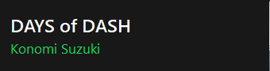

# SpotifyToast

A lightweight Windows tray app that pops up a toast notification whenever the **Spotify desktop app** changes track.



SpotifyToast reads the title of Spotify's window, which shows `Artist - Song` while music plays. It doesn't use the Spotify Web API, so there's no login, no API keys and no network access.

Inspired by [Toastify](https://github.com/aleab/toastify) by aleab. See [Credits](#credits-and-license).

## Features

- **Instant notifications.** It reacts to Windows title-change events (`SetWinEventHook`) instead of polling.
- **Unobtrusive toast.** The popup is always on top but never takes focus or appears in the taskbar. It fades in and out, and a click dismisses it.
- **Customizable look.** You can set the size, screen corner, margins, display duration and colors, with a live preview.
- **Global keyboard shortcut.** It shows the current song on demand (default `Ctrl+Alt+Shift+S`).
- **Start with Windows.** This is an optional per-user setting that doesn't need admin rights.
- **DPI-aware.** The toast stays sharp on high-DPI and mixed-DPI setups.
- **No dependencies.** It uses only .NET 8 and Windows Forms, with no NuGet packages.

## Requirements

| | |
|---|---|
| OS | Windows 10 or 11 (x64) |
| Spotify | The desktop app (the Microsoft Store and installer versions both work, but the web player isn't supported) |
| To build | [.NET 8 SDK](https://dotnet.microsoft.com/download/dotnet/8.0) |
| To run a framework-dependent build | [.NET 8 Desktop Runtime](https://dotnet.microsoft.com/download/dotnet/8.0) (not needed for the self-contained build) |

## Getting started

### Build and run from source

```powershell
git clone <repository-url>
cd SpotifyToast
dotnet run -c Release
```

The app starts in the system tray. Look under the **^** overflow arrow if you don't see the icon. Play something in Spotify and the toast appears.

### Create a portable exe for another PC

```powershell
dotnet publish -c Release -r win-x64 --self-contained true `
  -p:PublishSingleFile=true `
  -p:IncludeNativeLibrariesForSelfExtract=true `
  -p:EnableCompressionInSingleFile=true `
  -o publish
```

This produces a single `publish\SpotifyToast.exe` of about 70 MB with the .NET runtime bundled. Copy it to a permanent folder, such as `%LOCALAPPDATA%\SpotifyToast\`, and run it from there. **Start with Windows** saves the exe's current location, so don't run it from Downloads.

If the target PC already has the .NET 8 Desktop Runtime, you can make a much smaller build:

```powershell
dotnet publish -c Release -r win-x64 --self-contained false -p:PublishSingleFile=true -o publish-small
```

## Usage

| Action | Result |
|---|---|
| Song changes in Spotify | Toast appears |
| Press the shortcut (`Ctrl+Alt+Shift+S`) | Shows the current song again |
| Left-click the tray icon | Shows the current song again |
| Double-click the tray icon | Opens Settings |
| Right-click the tray icon | Menu: Show current song, Settings..., Start with Windows, Exit |

## Configuration

Open **Settings...** from the tray menu. Changes preview live. **Save** keeps them and **Cancel** reverts them.

| Setting | Range | Default |
|---|---|---|
| Width × height | 200–800 × 60–300 px (scaled for DPI) | 340 × 76 |
| Position | Bottom-right, bottom-left, top-right, top-left | Bottom-right |
| Horizontal / vertical margin | 0–400 px from the screen edge | 16 / 16 |
| Display duration | 1–60 s in 0.5 s steps, excluding the ~0.2 s fade | 4 s |
| Background, title and artist colors | Any color | `#181818`, `#FFFFFF`, `#1ED760` |
| Show-song shortcut | Any key combination, or none | `Ctrl+Alt+Shift+S` |

Settings are stored per user in `%APPDATA%\SpotifyToast\settings.json`:

```json
{
  "Width": 340,
  "Height": 76,
  "Corner": "BottomRight",
  "MarginX": 16,
  "MarginY": 16,
  "DurationSeconds": 4,
  "ShowHotkey": "Ctrl+Alt+Shift+S",
  "BackgroundColor": "#181818",
  "TitleColor": "#FFFFFF",
  "ArtistColor": "#1ED760"
}
```

You can edit the file by hand. Out-of-range values are clamped, and if the file is unreadable the app falls back to the defaults.

### Keyboard shortcut rules

- Letters, digits and similar keys need at least one of Ctrl, Alt or Shift. F1–F24, Pause and Scroll Lock can be used alone.
- The Win key isn't supported, because Windows reserves most Win+key combinations.
- If another app already owns the combination, **Save** is refused. If the saved shortcut is taken when the app starts, a tray notification appears and the app runs without it.
- The default uses three modifiers. That avoids clashing with AltGr (which Windows treats as Ctrl+Alt) on non-US keyboard layouts.

## How it works

```
Spotify.exe window title changes
        │  EVENT_OBJECT_NAMECHANGE / EVENT_OBJECT_DESTROY (SetWinEventHook)
        ▼
SpotifyWatcher ── is the window owned by Spotify.exe? (pid lookup, cached)
        │  debounce 250 ms (track skips fire several title changes)
        ▼
Read Spotify's title ── "Artist - Song"?  ── no (paused: "Spotify Premium") ──► ignore
        │ yes, and different from last time
        ▼
TrackChanged ──► ToastForm.ShowTrack()
```

- The title is split on the **first** ` - `, so `Song - Remastered 2011` stays intact.
- Pausing and resuming the same song shows the toast again.
- Hooks are registered out-of-context (`WINEVENT_OUTOFCONTEXT`). Nothing is injected into Spotify or any other process.

## Project structure

```
SpotifyToast/
├── Program.cs          # Entry point, single-instance guard
├── TrayContext.cs      # Tray icon, menu, wiring, Start with Windows
├── SpotifyWatcher.cs   # WinEvent hooks + Spotify window title parsing
├── ToastForm.cs        # The borderless, fading, custom-painted popup
├── SettingsForm.cs     # Settings dialog with live preview
├── AppSettings.cs      # Settings model, JSON load/save, validation
├── Hotkey.cs           # Hotkey parsing + RegisterHotKey wrapper
├── HotkeyBox.cs        # "Press a key combination" input control
├── Resources/app.ico   # Application and tray icon
└── docs/toast.png      # README screenshot
```

## Troubleshooting

| Problem | Fix |
|---|---|
| Windows shows "Windows protected your PC" | The exe isn't code-signed. Choose **More info**, then **Run anyway**, but only for a build you trust. |
| The app won't start on a work PC | Company policies (AppLocker, WDAC, Intune) may block unsigned apps. Ask IT to approve it or sign it. |
| No toast appears | Make sure you're using the Spotify **desktop app**, that music is playing (not paused), and that the tray icon is present. |
| "Shortcut is already used" | Another app registered the same combination. Pick a different one in Settings. |
| The toast is on the wrong monitor | Toasts always appear on the primary monitor. |

## Known limitations

- This relies on Spotify's window-title format, which is undocumented and could change in a future Spotify update.
- An artist name that itself contains ` - ` will be split in the wrong place.
- Ads may trigger a toast if Spotify gives them an `X - Y` title.
- Toasts only appear on the primary monitor.

## Privacy

SpotifyToast makes no network connections and collects no data. It reads only window titles of local `Spotify.exe` processes. It writes only its own settings file and, if you turn on **Start with Windows**, one value under `HKCU\Software\Microsoft\Windows\CurrentVersion\Run`.

## Credits and license

- **Inspiration:** the idea for SpotifyToast comes from [**Toastify**](https://github.com/aleab/toastify) by **aleab**, version 1.10.11. Toastify is a full-featured Spotify companion with toasts, media hotkeys and more. SpotifyToast is a from-scratch, minimal reimplementation of its core idea: a toast on track change. It shares no source code with Toastify.
- The application icon (`Resources/app.ico`) is `ToastifyIcon.ico`, taken from the Toastify 1.10.14 source and licensed under **GPLv2**. It's derived from the Spotify logo.
- **Spotify** is a trademark of Spotify AB. This project is not affiliated with, endorsed by or sponsored by Spotify.

<!-- TODO: choose a license for the source code and add a LICENSE file. -->
